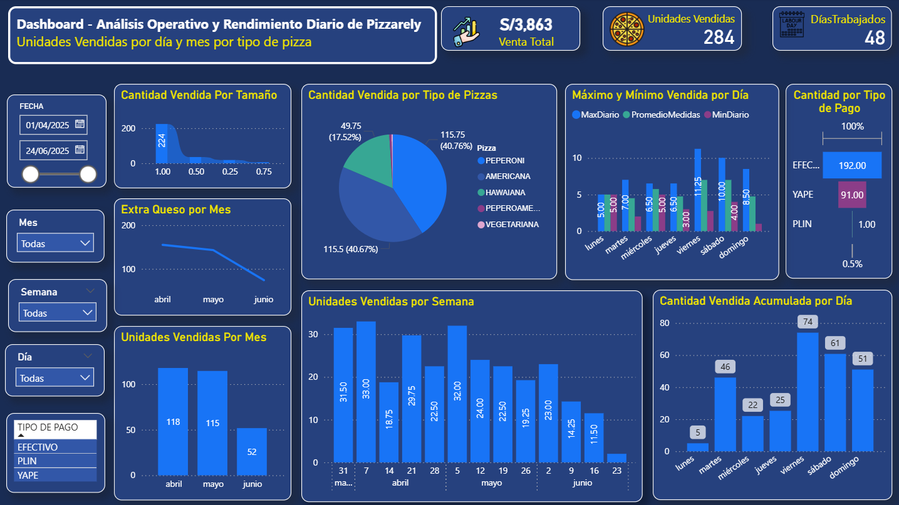

# Dashboard Contactabilidad - Power BI

Este proyecto muestra los indicadores de contactabilidad y adherencia de campañas en la UTP. Fue realizado usando Power BI Desktop.

## Indicadores principales:
- % llamadas atendidas
- Contactos por región
- Eficiencia por campus

